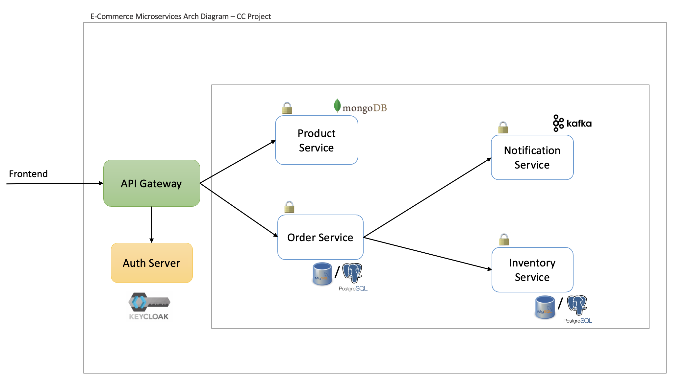

# E-Commerce Microservices with Spring Boot 

This is a team project as part of UE20CS351 - Cloud Computing Course at PES University.

### 🔨Technologies Used   
- Spring Boot  
- Postman  
- Maven
- Docker  
- Kubernetes  
- Jenkins  
- MongoDB  
- MySQL/PostgreSQL  

 

### Architecture

### 🛒 Services  
>[`order-service`](./order-service/)  
[`inventory-service`](./inventory-service)  
[`product-service`](./product-service/)  
[`notification-service`](./notification-service/)  

 

### ⛓️ Infrastructure 

>[`api-gateway`](./api-gateway/)  
[`discovery eureka server`](./discovery-server/)  
[`prometheus`](./prometheus/)  
[`grafana`](./grafana/)  
[`prometheus`](./prometheus/)  
`mongo`  
`postgres/mysql`  
`zipkin`  
`zookeeper`  
`keycloak`  

 

### Run the application using Docker

1. Run `mvn clean package -DskipTests` to build the applications and create the docker image locally.
2. Run `docker-compose up -d` to start the applications.

### Run the application without Docker

1. Run `mvn clean verify -DskipTests` by going inside each folder to build the applications.
2. After that run `mvn spring-boot:run` by going inside each folder to start the applications.

**☸️ Kubernetes deployment in [k8s](./k8s/) **
 **🐳 Images at [Docker Hub](https://hub.docker.com/u/hitajuneja)**
